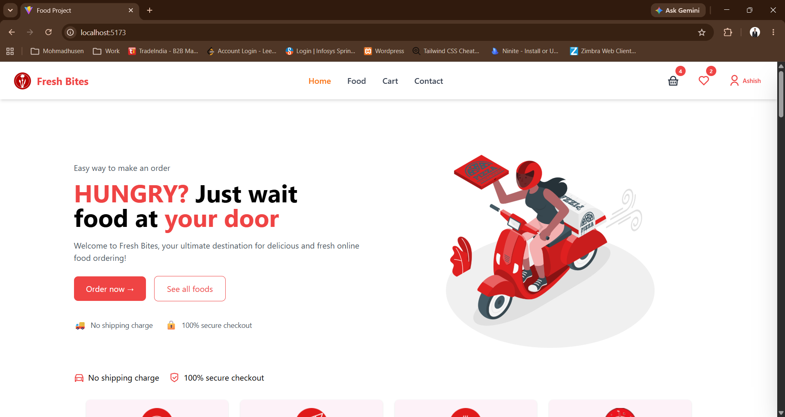
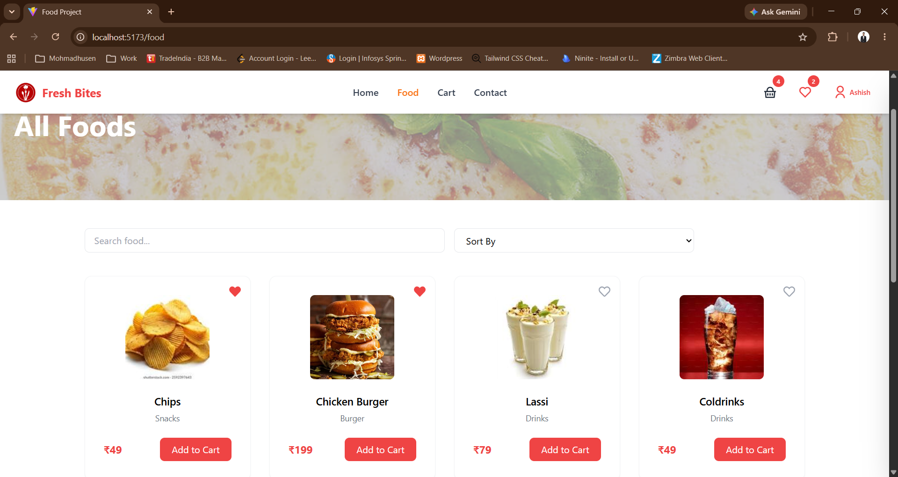
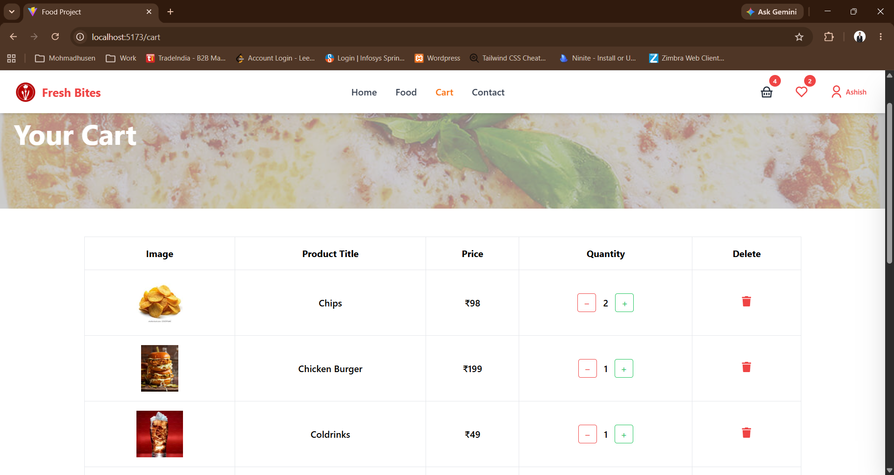
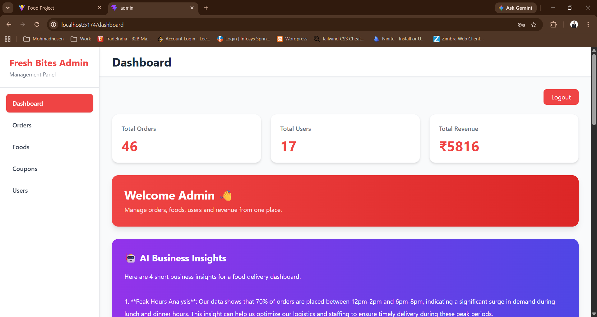
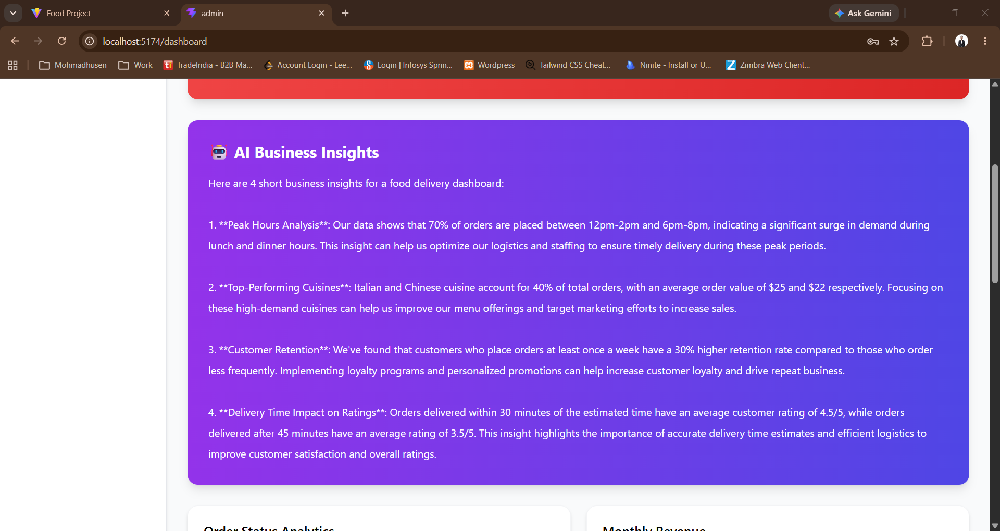

# 🍔 FreshBites - AI Powered Food Delivery Platform


---

# 📌 Project Overview

**FreshBites** is a modern **AI-powered Food Delivery Platform** built using the **MERN Stack (MongoDB, Express.js, React.js, Node.js)**.

The platform provides a complete food ordering ecosystem with:

- Customer food ordering experience
- Secure authentication system
- Admin management dashboard
- Order management workflow
- Analytics and business insights
- AI-powered review analysis

This project was developed during my **MERN Stack Developer Internship at Maxgen Technologies Pvt. Ltd., Ahmedabad**, where I worked on building full-stack features using modern web technologies and industry development practices.

---

# 🚀 Key Highlights

✨ Full-stack MERN Architecture  
✨ JWT Based Secure Authentication  
✨ Firebase Google Authentication  
✨ Role Based User & Admin System  
✨ AI Powered Business Intelligence  
✨ AI Review Summarization  
✨ Interactive Analytics Dashboard  
✨ Email Notification System  
✨ Responsive Modern UI Design  

---

# 🛠️ Technology Stack

## 🎨 Frontend

- React.js
- Vite
- Tailwind CSS
- React Router DOM
- Axios
- Context API
- Recharts

---

## ⚙️ Backend

- Node.js
- Express.js
- RESTful APIs
- JWT Authentication
- Firebase Admin SDK
- Nodemailer
- MongoDB
- Mongoose

---

## 🗄️ Database

- MongoDB
- MongoDB Atlas
- Mongoose ODM

---

## 🤖 Artificial Intelligence

- Groq AI API
- Llama 3.3 Model

AI Features:

- Business Insights Generation
- Customer Review Analysis
- AI Recommendations

---

## 🧰 Development Tools

- Git & GitHub
- VS Code
- Postman
- MongoDB Compass
- npm

---

# ✨ Features

# 👤 User Module

## 🔐 Authentication

- User Registration
- User Login
- JWT Authentication
- Google Login using Firebase
- Secure User Sessions
- Protected Routes


## 🍕 Food Ordering

- Browse Food Menu
- Search Food Items
- Category Based Filtering
- Add To Cart
- Wishlist Management
- Multiple Delivery Addresses
- Place Orders
- Order History
- Order Tracking


## ⭐ Customer Experience

- Product Ratings
- Customer Reviews
- PDF Invoice Generation
- Email Order Notifications
- Responsive Mobile Friendly UI


---

# 👨‍💼 Admin Dashboard

A complete admin panel to manage the food delivery ecosystem.

## 📊 Dashboard Analytics

Admin can view:

- Total Users
- Total Orders
- Total Revenue
- Revenue Growth
- Order Statistics
- Top Selling Food Items
- Recent Orders


## 📦 Management System

Admin Features:

- Manage Users
- Manage Food Products
- Manage Categories
- Manage Orders
- Update Order Status
- Coupon Management
- Newsletter Management
- Customer Contact Management


---

# 🤖 AI Powered Features

## 🧠 AI Business Insights

The system analyzes business data and generates intelligent insights.

Features:

- Sales Performance Analysis
- Revenue Trend Analysis
- Customer Behaviour Insights
- Business Improvement Suggestions


---

## ⭐ AI Review Summarizer

Automatically analyzes customer reviews and provides:

- Positive Feedback Summary
- Common Customer Complaints
- Customer Satisfaction Insights
- Improvement Recommendations


---

# 📈 Admin Analytics Dashboard

Interactive dashboard built with charts and data visualization.

Includes:

- Revenue Graph
- Order Status Chart
- Sales Performance
- Food Popularity Analysis
- Business Growth Reports


---

# 🔐 Security Features

- JWT Token Authentication
- Password Hashing
- Protected Backend Routes
- Role Based Authorization
- Firebase Token Verification
- Secure Environment Variables
- API Protection


---

# 📂 Project Structure


```
FreshBites/

│
├── frontend/
│   └── React User Application
│
├── backend/
│   └── Node.js Express API Server
│
├── admin/
│   └── Admin Dashboard Application
│
└── README.md
```


---

# ⚙️ Installation & Setup

## 1. Clone Repository

```bash
git clone <repository-url>

cd MERNFoodProject
```


---

# Backend Setup

```bash
cd backend

npm install
```


Create `.env` file inside backend folder:

```env
MONGODB_URI=your_mongodb_connection_string

JWT_SECRET=your_jwt_secret

EMAIL_USER=your_email

EMAIL_PASS=your_email_password

GROQ_API_KEY=your_groq_api_key
```


Run Backend:

```bash
npm start
```


Backend will start on:

```
http://localhost:5000
```


---

# Frontend Setup

```bash
cd frontend

npm install
```


Run React Application:

```bash
npm run dev
```


Frontend will start on:

```
http://localhost:5173
```


---

# Admin Dashboard Setup

```bash
cd admin

npm install
```


Run Admin Panel:

```bash
npm run dev
```


---

# 🔌 API Modules

## Authentication API

- Register User
- Login User
- Google Authentication
- Profile Management


## Food API

- Get Food Items
- Create Food
- Update Food
- Delete Food


## Order API

- Create Order
- Get Orders
- Update Order Status


## AI API

- Generate Business Insights
- Analyze Reviews


---
# 📸 Screenshots

## 🏠 Home Page




## 🍕 Food Menu




## 🛒 Cart Page




## 👨‍💼 Admin Dashboard




## 🤖 AI Business Insights




---

# 🎯 Learning Outcomes

Through this project, I gained practical experience in:

✅ Building scalable MERN applications  
✅ Creating REST APIs  
✅ Authentication & Authorization  
✅ Firebase Integration  
✅ AI API Integration  
✅ MongoDB Database Design  
✅ Dashboard Development  
✅ Third-party API Integration  
✅ Git & GitHub Workflow  
✅ Deployment Process  


---

# 🏢 Internship Project Information

## Developed During

**MERN Stack Developer Internship**

## Organization

**Maxgen Technologies Pvt. Ltd., Ahmedabad**

## Role

**MERN Stack Developer Intern**


## Technologies Used

- React.js
- Node.js
- Express.js
- MongoDB
- Tailwind CSS
- REST APIs
- Firebase Authentication
- AI Integration


---

# 👨‍💻 Developer

## Mohmadhusen Khimani

**MERN Stack Developer | AI/ML Enthusiast**

### Skills

- React.js
- Node.js
- Express.js
- MongoDB
- JavaScript
- Artificial Intelligence


---

# 🔗 Connect With Me

### GitHub

https://github.com/mohmadhusenkhimani


### LinkedIn

https://www.linkedin.com/in/mohmadhusenkhimani/


---

# ⭐ Support

If you like this project, consider giving it a ⭐ star on GitHub.

Thank you for visiting **FreshBites** 🚀
